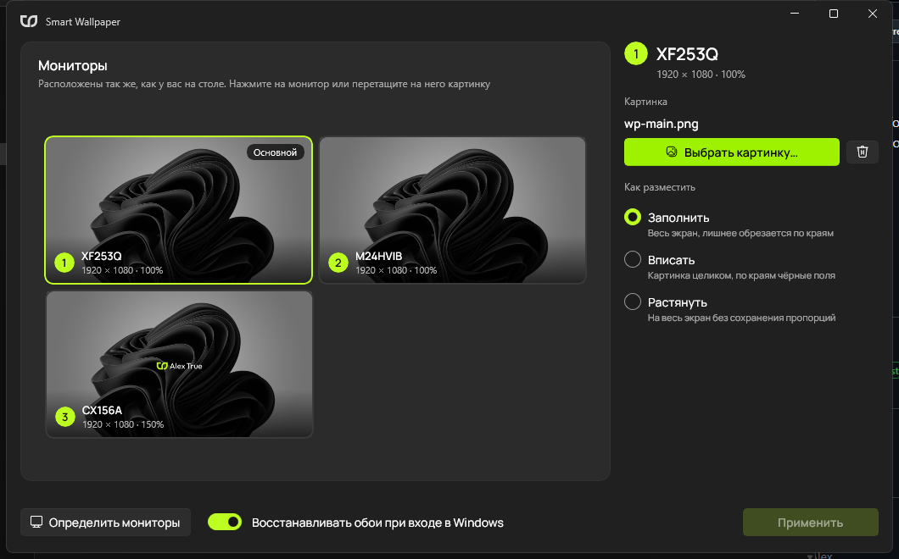

# SmartWallpaper

SmartWallpaper is a native Windows 11 app (WinUI 3) that sets a different wallpaper on each monitor — with a visual monitor layout, per-monitor fit modes and protection against Windows resetting your wallpapers.



## ✨ Features

- 🖥️ Visual monitor layout — arranged exactly like in *Settings → Display*, with number, name, resolution and scale
- 🖱️ Drag & drop an image onto a monitor, double-click it, or use *Select image…*
- 🎯 Per-monitor fit mode: **Fill**, **Fit** (with black bars) or **Stretch** — the preview shows exactly what you get
- 🔢 *Identify monitors* — shows a big number on every physical screen
- 🧠 Native per-monitor wallpapers via Windows `IDesktopWallpaper` — no more stitching one giant image
- 🎨 Each image is pre-rendered pixel-perfect for its monitor's resolution
- 🛡️ Survives sudden power loss — see below

## 🛡️ Wallpapers no longer reset

Previously Windows could reset the wallpaper after a sudden shutdown. Now:

1. Selected images and rendered wallpapers are stored in `%LOCALAPPDATA%\SmartWallpaper` instead of the temp folder.
2. Registry changes are flushed to disk right after applying.
3. **Restore wallpapers at sign-in** (on by default) — at logon the app silently re-applies your wallpapers (`SmartWallpaper.exe --restore`, no window) and re-renders them if a monitor's resolution changed.

## 📦 Requirements

- Windows 10 (1809+) or Windows 11, x64
- Nothing else — .NET and Windows App SDK are bundled into the single `.exe`

## 🚀 How to use

1. Download and launch `SmartWallpaper.exe` — no installation needed.
2. Pick an image for each monitor.
3. Click **Apply** — done!

<div align="center">
  <a href="https://github.com/trunjeee/SmartWallpaper/releases/latest/download/SmartWallpaper.exe">
    
  </a>
</div>

## 🛠️ Manual build

Requires .NET SDK 10.

```bash
dotnet publish -c Release -o publish-single -p:PublishSingleFile=true -p:IncludeAllContentForSelfExtract=true -p:EnableCompressionInSingleFile=true -p:DebugType=none
```

Stack: WinUI 3 (Windows App SDK 1.8), .NET 10, CommunityToolkit.Mvvm.


